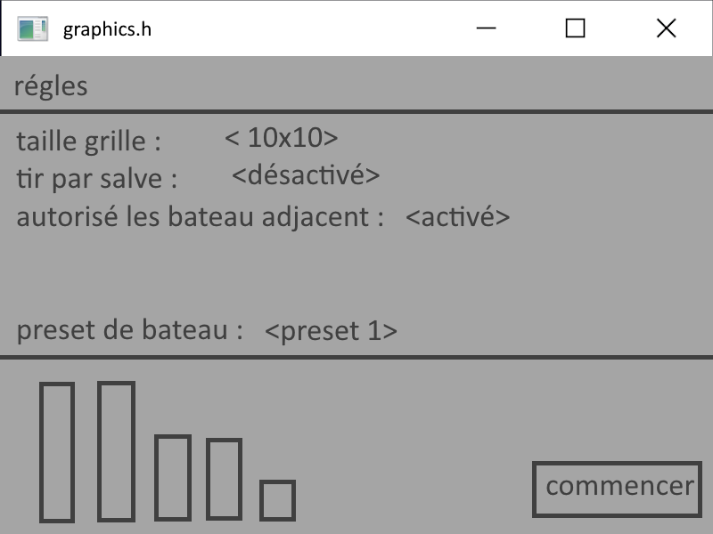
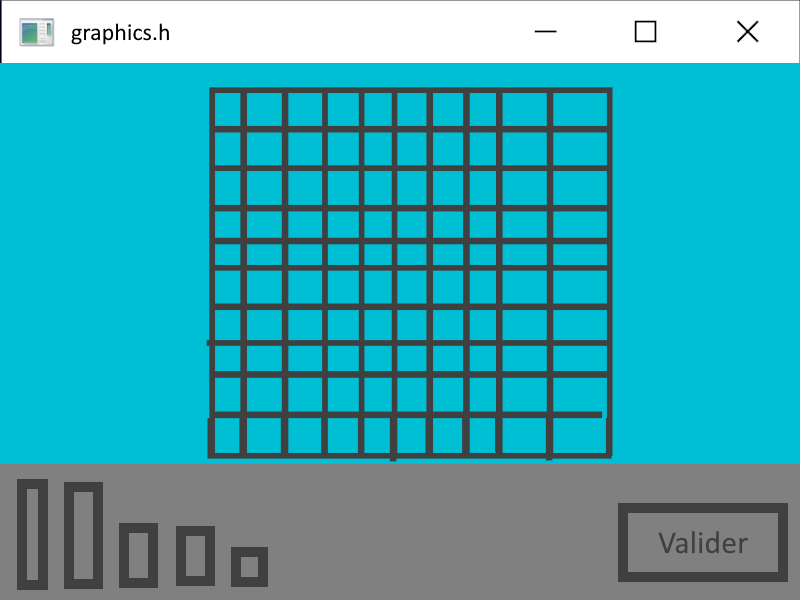
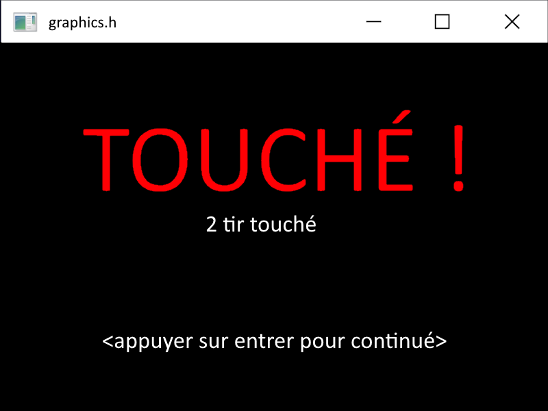
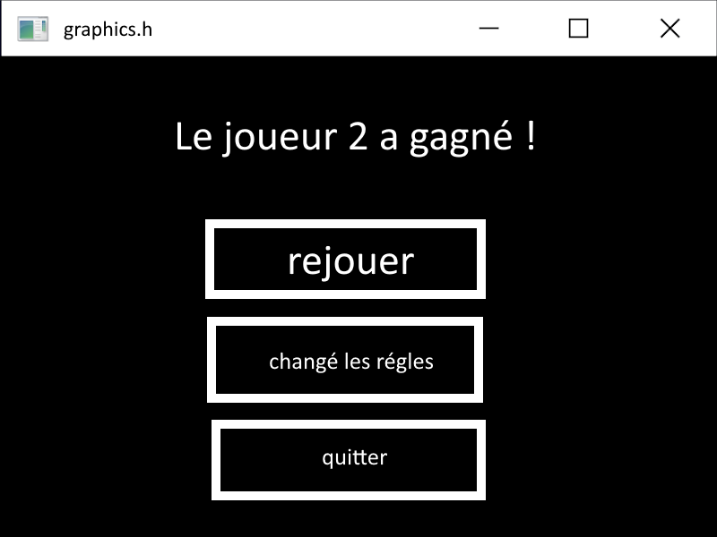

# Maquette

## introduction

voici la première version de la maquette du jeu "Bataille Navale"
Toute les image que vous verrez ici sont conceptuel et ne sont en aucun cas un produit fini, tout est susceptible au changement.

## Menue

### Ecran titre

Comme tout jeu qui se respecte, le jeu demarre sur un ecran titre, mais comme un ecran titre est la première chose que l'on vois il faut que ça soit parfait !

Ainsi l'ecran titre se compose d'un titre et de differente image (comme des nuages) animées pour donner de la profondeur et du mouvement.

/!\ les images peuvent etres animées cependant le nombre de couleur est limité.

l'écran titre demandera un input des joueurs sur entrée pour continué

### séléction des régles du jeu

comme vu avec le client beaucoup d'option de jeu sont disponible, il faut donc avant tout un écran de selection de régles.

les differentes option sont changeable a la sourie en cliquant sur les flèches

en bas de la fênetre on peut voir une preview des bateaux, ici il sont décrit par des cubes mais la possibilité d'utilisé des images plus détaillé est envisagable.

## Jeu

### Changement de joueur

Comme le jeu est en multijoueur local, il faut un moyen de cacher au joueur la grille de l'autre, ainsi il faut une fenetre de changement de joueur que les joueur est le temps de changé.

### Selection des bateaux

Les joueurs doivent en premier lieu placé leur bateaux, il faut donc une fênetre qui permet de choisir quelle bateau placé où.

le joueur pourra glisser-deposer les bateaux sur la grille et les tourner avec la molette, le bouton valider sera grisé tant que tout les bateaux ne sont pas placé.

### Grille principal

après avoir placé les bateaux, la partie demarre. Il faut donc un ecran principal pour selectionner l'emplacement des salves a tiré

La grille principal est coupé en deux grille, une appartenant au joueur courant qui montre quel bateau est touché et l'emplacement des tir raté de l'ennemie.
on y voit le nombre de salve restant a placé (1 seul si le mode salve est désactivé). 
Dans la seconde grille on y vois l'emplacement des tirs raté ou touché (les tir touché sont afficher comme des tir normaux si le mode salve est activé) et le joueur doit placé les salves sur la grille.

Pour le moment nous avons représenter les tir par des rond de differente couleur cependant ce n'est pas très daltonien-friendly et est sujet a changement.

le bouton validé est grisé jusqu'a ce que toute les salves soit placé

### ecran de résultat

Après avoir tiré les slaves, le resultat du nombre de salve touché s'affiche

a noté que le texte en rouge change selon :
- touché
- coulé
- a l'eau

### ecran fin de partie

a la fin de la partie, le joueur gagnant est annoncé, et trois option sont disponible.
- rejouer
- changé les régles
- quitter 

# source

image ecran titre : https://fr.123rf.com/photo_118978853_image-d%C3%A9taill%C3%A9e-du-navire-militaire-vue-de-dessus-de-face-et-de-c%C3%B4t%C3%A9-mod%C3%A8le-3d-de-cuirass%C3%A9.html